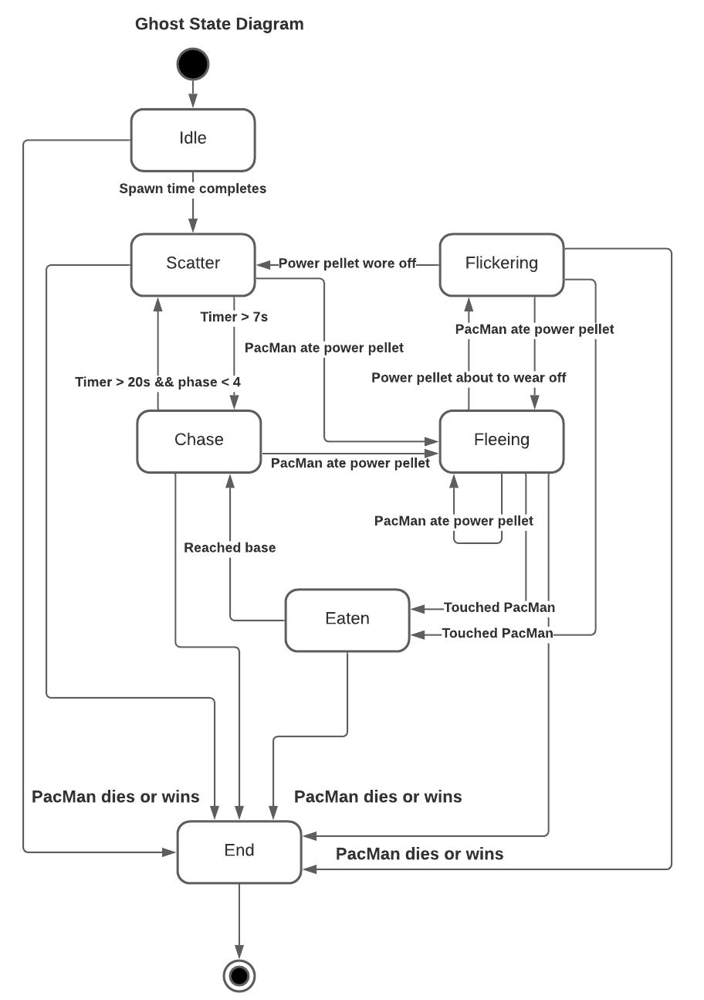

# ARCHITECTURE

## Package Index

The project is divided into different packages. Each one contains specific structs
and operation that serve a specific purpose. A high level overview of every
directory/package can be seen here:

* **assets**: All sprites, images and audios used in the game
* **src**
  * **constants**: Constants used in the application
  * **contexts**: Structs that represent different game contexts
  * **controller**: Game controller that switches between screens and controls main flow
  * **interfaces**: All defined interfaces
  * **models**: Game objects
  * **modules**: Common modules (e.g. collision detector, sound player, etc.)
  * **screens**: Game screens (e.g. Main menu, level, game over, etc.)
  * **structures**: Shared data structures in the game
  * **utils**: Custom operations not included in the Go standard library

## Architecture

**Use case of a normal game as a sequence diagram**

### Game Objects

Every sprite that you see in the game is represented by an instance of a game object.
We defined a `GameObject` interface, which serves as an abstraction of every object in the maze.
Some concrete structs that implement that interface are: `Wall`, `Ghost`, `Pellet`, etc.

The data structure that we are using to represent the game map is the `Maze` struct.
This struct has a matrix, which holds groups of game objects according to their
current position in the layout.

Another important interface, subset of a `GameObject` is the `MovableGameObject`,
which represents game objects that can move around the map, like ghosts or PacMan.
This interface declares a method to set the position of the game object.

### Animations

In order to achieve the animations for each game object, we created a `SpriteSequence`
struct, which holds an array of Ebiten images and the current sprite index. All
movable objects have a sprite sequence. Static game objects only have a single sprite.

Then, we created an `Animator` struct, which keeps a reference to the game object at hand
and is responsible for drawing the corresponding sprite of the game object during each frame.
This way, we take away from all game objects the responsibility to draw themselves
and make it simpler to display animations.

> A movable game object can have more than one animation, so the sprite sequence
> to be used by the animator is decided by the current movable game object's state

### Collision Detection

An important step of the behavior of a movable game object is the ability to detect collisions.
We created a `CollisionDetector` struct that can be attached to all movable game objects.
This struct holds a reference to the `Maze` struct and uses it alongside the game object's
position and direction to find possible collisions. Then, the movable game object is responsible for
deciding what to do with the colliding objects depending on its internal state.

### Goroutines

Every game object declares a *run* method to handle internal behavior, and a *draw* method
than draws on screen. Static game objects do not implement their *run* method, only their
*draw* method. Movable game objects, on the other hand, use their *run* method to decide
where to move at each step, check for collisions and notify the level of any important event.
These methods are all ran as different goroutines, so they use a mutex to access
the map data structure and move.

All of the game object's goroutines are created by the level goroutine.
Communication between the other goroutines and the level goroutine is achieved through channels.
Some events that are catched by the level are *Game Over* events, *Power Pellet Eaten* events, etc.
Depending on the event, the level can choose to play a different background effect or
event change the state of some game objects.

Any global data that a game object's goroutine needs to access (like the maze) is
shared through a `GameContext` struct. Which is provided by the level and represents
the context of the current level. We also defined an `AnchorContext` struct that
represents the context of the entire game. It is shared among all game screens.

### Switching Screens

The game controller is the brain that is responsible for switching screens after
the previous one has finished. Whenever a screen is instantiated, its run method
is called as a separate goroutine. Every game screen comunicates with the game via
channels. When a screen finishes, it notifies the game to change state and the game
will instantiate and run the appropriate screen.

## PacMan Behavior

PacMan can move in four different directions: Up, Down, Left and Right.
It is controlled by using the arrow keys (WASD is not supported).

PacMan has only four states. We decided to implement a state machine to better
represent its behavior. The state diagram associated to PacMan can be seen below:

In code, we used a state pattern that allows PacMan to easily change its behavior
given its current state. For this, we defined a `PacmanState` interface and some
concrete structs that represent all states. Every state defines possible transitions.

## Ghost Behavior

We decided to adopt the original PacMan's ghost AI and made some tweaks to it.
The state diagram for every ghost can be seen below:

Just like PacMan, a ghost state machine is represented by the state pattern.

The two most important ghost states are `Scatter` and `Chase`. In the `Scatter`
state, every ghost goes to a predefined location in the map. There are four bases
located at each corner. There is one for each type of ghost.
`Scatter` state only lasts for 7 seconds, after that, ghosts will transition to the
`Chase` state, which lasts for 20 seconds before going back to `Scatter`. Once a ghost
reaches the `Chase` state for the fourth time, it's stuck in there forever.

There are four different types of ghosts and each one has a different chasing behavior.
These behaviors were based on the original game and some of them were tweaked:

*  - Calculates the distance
  between every adjacent tile and PacMan's position at every turning point.
  Then chooses the tile which is closer to PacMan.
*  - Like Red, but instead of heading towards
  PacMan's position, its target is the position of the tile which is 3 tiles ahead
  in PacMan's direction.
*  - Like Pink, but it targets the position
  of the tile which is 3 tiles opposite to PacMan's direction.
*  - If the ghost is very close to PacMan,
  it will start moving on a random direction. If it is far, it will move towards it.

Whenever PacMan eats a power pellet, every ghost will transition into the `Fleeing`
state. Whenever a ghost is in this state, it will be eaten when it comes in contact
with PacMan. Then, it goes back to home and spawns in the `Chase` state.

Even if PacMan is still under the influence of the power pellet, any ghost that is
not in `Fleeing` or `Flickering` state can kill him.

> When the game specifies more than 4 enemies, there will be repeated ghost types.

## References

[Pac-Man Ghost Behavior](https://gameinternals.com/understanding-pac-man-ghost-behavior)
