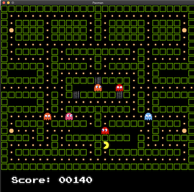

# MultiThreadedPacman

This is an implementation of the original PacMan game using a multithreaded approach.
Each enemy is an independent thread and the number of enemies is configurable.



## Tech Stack

The project was built using Golang with [Ebiten](https://ebiten.org/),
a simple, cross-platform 2D game library.

## Functional Requirements

* The game's maze layout can be static.
* The pacman gamer must be controlled by the user.
* Enemies are autonomous entities that will move a random way.
* Enemies and pacman should respect the layout limits and walls.
* Enemies number can be configured on game's start.
* Each enemy's behaviour will be implemented as a separated thread.
* Enemies and pacman threads must use the same map or game layout data structure resource.
* Display obtained pacman's scores.
* Pacman loses when an enemy touches it.
* Pacman wins the game when it has taken all coins in the map.

## System Requirements

This project uses go modules, so Ebiten will be installed automatically as
you build the project. For Ebiten to work, you'll need to have installed:

* [Golang](https://golang.org/) version 1.15 or above
* C compiler (Only if you are using MacOS or Linux)
* Depending on which platform you are using, you might need to install some extra dependencies.
  Follow Ebiten's installation intructions [here](https://ebiten.org/documents/install.html?os=linux) 

> We tested the project in MacOS and Ubuntu.

## Build/Run

### First build, then run

To build the executable, run:

```bash
$ make build
```

Then, run it with:

```bash
$ ./MultithreadedPacman
```

To specify the number of enemies:

```bash
$ ./MultithreadedPacman -n 5
```

### Build and run all at once

To build and run:

```bash
$ make run
```

To specify the number of enemies:

```bash
$ make run ENEMIES=5
```

> The maximum number of enemies allowed is 8 because the game becomes practically impossible.

## Architecture

Visit the architecture document [here](./ARCHITECTURE.md).

## Video Presentation

You can check out the video [here](https://youtu.be/aHMOOvbfAsE).
